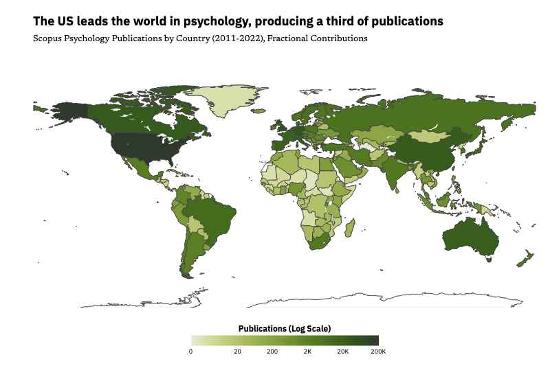
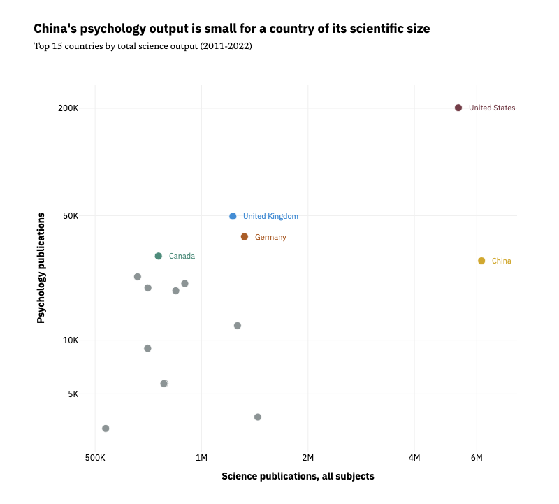
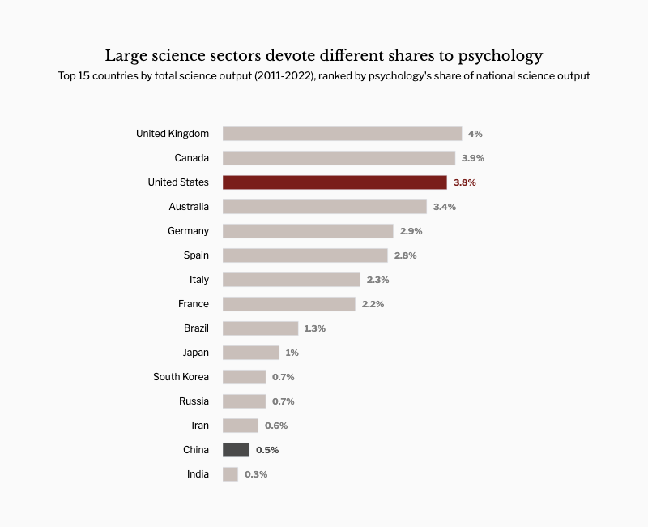
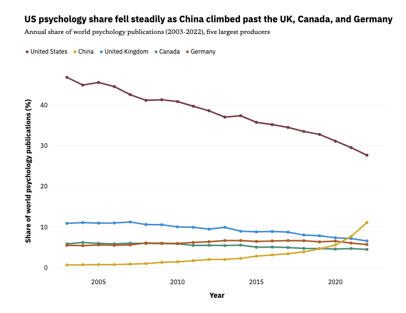

# Who Decides What Psychology Says?

__Public understanding of typical human behavior is shaped by the perception of psychology as an authoritative voice.__

Click [here](https://emilinelabbe.github.io/who-decides-what-psych-says/) for the write-up.

Publication counts aggregated in National Science Foundation Science & Engineering (NSF S&E) Indicators reflect the current state of affairs, including which countries produce science and how much of it is psychology.

### Key findings
1. __The US leads the world in psychology.__ It writes a third of the world's psychology (33.8%), nearly double its share of science (17.4%). Holding only 4.3% of the global population, it is highly overrepresented.
2. __China leads the world in science, yet trails the US, the UK, Canada, and Germany in psychology.__ It is the only non-WEIRD member of the top-5 contributors to global psychology.
3. __The top 15 largest science sectors produce psychology research at varying rates.__ Psychology share of national output spans 0.3% (India) to 4% (the UK). The US ranks third at 3.8%, publishing psychology at a high rate on top of an already large research base.
4. __The contributor landscape is diversifying.__ WEIRD countries produced two-thirds of the world's psychology publications in 2022, down from 90% in 2003. The US annual share fell from 46.8% to 27.7% during this time, while China's rose from 0.7% to 11.1%.

Full analysis: [notebooks/01_data_insights.ipynb](notebooks/01_data_insights.ipynb)

